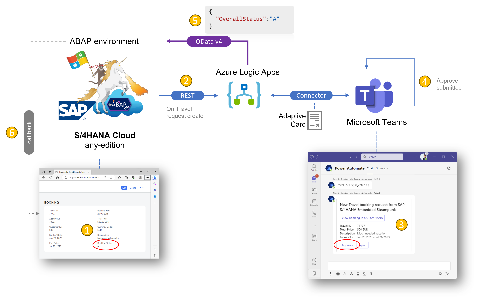

# SAP S/4HANA Cloud ABAP Environment integration journey with Microsoft – Part 1

< 🏡[home](../README.md)

## Import artifacts 📥

Use below button to create the Azure Logic App:

[ABAP snippet for SAP booking approval via Microsoft Teams](./ZEVENT_BP_BOOKINGTP_XXXX.abap)

## SAP Developer tutorials used 👩🏼‍🏫

- [How to Create RAP Business Events in an On-Premise system](https://developers.sap.com/tutorials/abap-environment-create-s4hana-rap-business-events.html)
