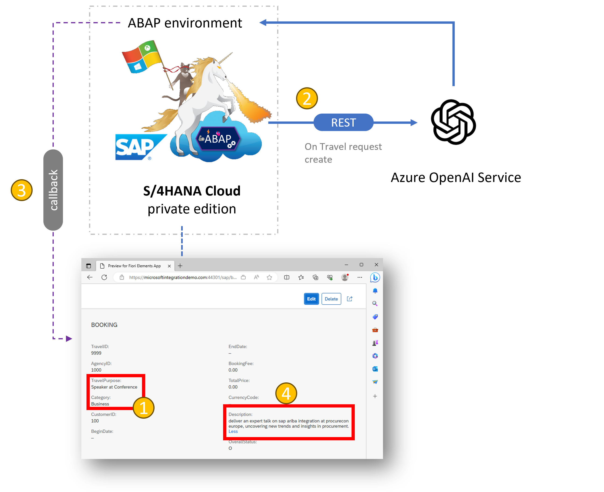

# SAP S/4HANA Cloud ABAP Environment integration journey with Microsoft – Part 2

< 🏡[home](../README.md)

## Prerequisites

- Azure OpenAI service instance. Learn how to deploy [here.](https://learn.microsoft.com/azure/ai-services/openai/how-to/create-resource)
- [Deploy](https://learn.microsoft.com/azure/ai-services/openai/how-to/create-resource?#deploy-a-model) your GPT model. For this tutorial `gpt-35-turbo` (model version 0301) was used.
- Maintain your Azure OpenAI service instance credentials in the [Azure OpenAI getSDK ABAP method](ZEVENT_BP_BOOKINGTP_100.abap#L34) section of the class. Find your API key and endpoint in the [Azure portal](https://portal.azure.com/?#view/Microsoft_Azure_ProjectOxford/CognitiveServicesHub/~/OpenAI). Navigate to section `Resource Management > Keys and Endpoint > Key 1`
- Consider [private virtual network access](https://learn.microsoft.com/azure/ai-services/cognitive-services-virtual-networks) for both your SAP S4/HANA Cloud on Azure and Azure OpenAI service instance. Navigate to `Resource Management > Networking > Firewalls and virtual networks` in the Azure portal and verify presence of the virtual network where your SAP lives.

## Import artifacts 📥

- [ABAP class for enriched SAP booking create experience with GPT running on Azure OpenAI](./ZEVENT_BP_BOOKINGTP_100.abap)
- [enhanced ABAP table to support the scenario beyond the SAP tutorial](./ZBOOKING_000.abap)
- [CDS view behavior definition](./ZEVENT_R_BOOKINGTP_100.abap)
- [CDS projection view data definition](./ZEVENT_C_BOOKINGTP_100.abap)

## SAP Developer tutorials used 👩🏼‍🏫

- [How to Create RAP Business Events in an On-Premise system](https://developers.sap.com/tutorials/abap-environment-create-s4hana-rap-business-events.html)
